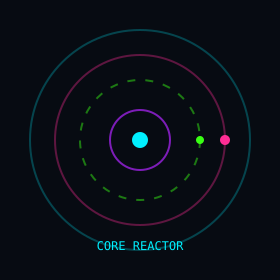
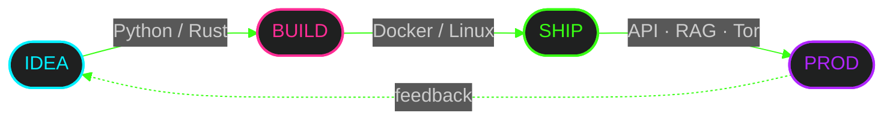

<!--
  LIGHTCLOVE — neon cyberpunk profile
  custom SMIL animations in /assets · interactive 
 · live telemetry widgets
-->

 

 

 

---

<b>🕹️ &nbsp;ENTER THE GRID — identity.sys</b>

 

| | |
|:--:|:--:|
|  | **Saint Petersburg** · remote / hybrid · full-time  Engineer→backend→fullstack. APIs · integrations · industrial protocols · telecom · document search.  In **Rust** — networking clients & Telegram bots: idea → compact release (Windows / Linux / Android).  `uptime = 15y` · `neon_core = ONLINE` |
|  |   |

---

<b>⚡ &nbsp;tech_stack.exe — click to collapse</b>

 

  

 

`core :: Python · FastAPI · PostgreSQL · Docker · Linux · Rust · C++`

 

---

<b>📡 &nbsp;telemetry.hub — live GitHub signal</b>

 

 

 

 

---

<b>🛸 &nbsp;projects.neon — choose a sector</b>

 

<code>[01]</code> <b>Rust · edge / bots / Tor</b>

| Project | Signal |
|:--|:--|
| **rbot** | Telegram expense bot — Python→Rust static binary · Postgres · Ollama · Tor |
| **rmalyk** | Windows «Tor instead of VPN» — HTTP→SOCKS · bridges · exe &lt; 1 MB · zero crates |
| **mmalyk** | Android Malyk — Rust UI + JNI/NDK · VpnService · bundled libtor |
| [**MSA_Searcher_rust**](https://github.com/lightclove/MSA_Searcher_rust) | File catalog search + LLM — single `.exe` · SPA |

<code>[02]</code> <b>Python · RAG / 1C / face</b>

| Project | Signal |
|:--|:--|
| [**AI_Docs_Generator**](https://github.com/lightclove/AI_Docs_Generator) | RAG over PDF via LM Studio · Qdrant · hybrid search |
| [**Uniface**](https://github.com/lightclove/Uniface) | Face login → PIN → session · 1C API · liveness |
| [**lightcloves_fin_bot**](https://github.com/lightclove/lightcloves_fin_bot) | Telegram finance bot (Python origin of rbot) |
| [**LM_Studio_1C_Proxy**](https://github.com/lightclove/LM_Studio_1C_Proxy) | FastAPI proxy 1C ↔ LM Studio · TDD |

---

<b>🗺️ &nbsp;signal.map — pipeline hologram</b>

 

---

<b>🐍 &nbsp;contribution.wave — live activity signal</b>

 

---

## 🎓 `edu.chip`

*mathematician · systems programmer*

## ☎️ `uplink`

 

`// stay neon · ship compact · trust the binary`

