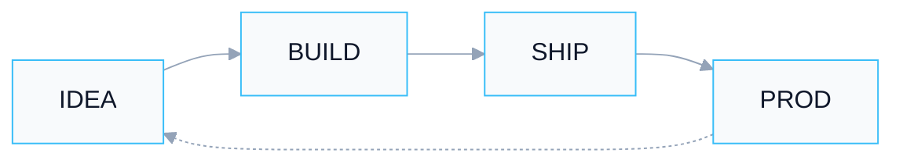

<!--
  LIGHTCLOVE profile (QA pass)
  - GitHub cannot recolor page background → neon lives in dark panels
  - Absolute raw.githubusercontent.com URLs (no relative, no CDN cache lag)
  - SVG without feGaussianBlur (GitHub camo-safe)
  - No flaky vercel/streak widgets (were 503 → broken icons)
-->

 

 

 

 

---

<b>identity.sys</b>

 

| | |
|:--:|:--:|
|  | **Saint Petersburg** · remote / hybrid · full-time  Engineer→backend→fullstack. APIs · integrations · industrial protocols · telecom · document search.  In **Rust** — networking clients & Telegram bots: idea → compact release (Windows / Linux / Android).  `uptime=15y` · `neon_core=ONLINE` · `meetings=404` |
|  |   |

---

<b>tech_stack</b>

 

  

 

`core :: Python · FastAPI · PostgreSQL · Docker · Linux · Rust · C++`

 

---

<b>projects</b>

 

<code>[01]</code> Rust · edge / bots / Tor

| Project | Signal |
|:--|:--|
| **rbot** | Telegram expense bot — Python→Rust static binary · Postgres · Ollama · Tor |
| **rmalyk** | Windows «Tor instead of VPN» — HTTP→SOCKS · bridges · exe &lt; 1 MB |
| **mmalyk** | Android Malyk — Rust UI + JNI/NDK · VpnService · libtor |
| [**MSA_Searcher_rust**](https://github.com/lightclove/MSA_Searcher_rust) | File catalog search + LLM — single `.exe` · SPA |

<code>[02]</code> Python · RAG / 1C / face

| Project | Signal |
|:--|:--|
| [**AI_Docs_Generator**](https://github.com/lightclove/AI_Docs_Generator) | RAG over PDF via LM Studio · Qdrant · hybrid search |
| [**Uniface**](https://github.com/lightclove/Uniface) | Face login → PIN → session · 1C API · liveness |
| [**lightcloves_fin_bot**](https://github.com/lightclove/lightcloves_fin_bot) | Telegram finance bot (Python origin of rbot) |
| [**LM_Studio_1C_Proxy**](https://github.com/lightclove/LM_Studio_1C_Proxy) | FastAPI proxy 1C ↔ LM Studio · TDD |

---

<b>signal.map</b>

 

---

**PGUPS**, 2009 · applied mathematics & informatics

[Telegram](https://t.me/lightclove) · [Email](mailto:dm.ilyushko@gmail.com) · [GitHub](https://github.com/lightclove)

`// stay neon · ship compact · trust the binary`

